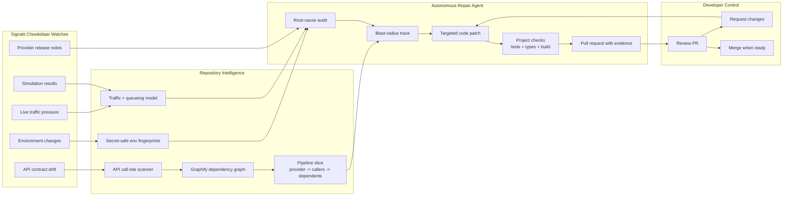

# Chowkidaar

See the Demo Video:
[](https://repoclip.io/v/3b3f2e45-ce5d-4522-ab96-eb7642b48866)

**An autonomous API reliability layer for projects that depend on external services.**

Chowkidaar, meaning "watchman," turns API maintenance into an always-on agent. It watches the APIs your code depends on, maps the exact code paths they touch, detects drift or pressure before users feel it, writes a focused fix, runs your checks, and opens a pull request for review. It never merges for you.

## System Graph



```text
External API changes before your code breaks
              |
              v
Chowkidaar narrows the repo to the exact affected pipeline
              |
              v
Agent writes the smallest safe patch and proves it with your checks
              |
              v
You review a PR instead of debugging a production surprise
```

## Why It Matters

API integrations usually break after a provider changes something and a developer notices. Chowkidaar starts earlier:

1. It watches API contracts, environment changes, and traffic pressure.
2. It builds a focused graph from provider calls to affected files.
3. It uses the graph to patch only the relevant code.
4. It validates the patch with the project's own tests, typecheck, and build.
5. It opens a pull request with the evidence.

## Core Features

- **Repository graph**: maps external API usage into a visual dependency graph so the agent does not wander through the whole codebase.
- **Local and GitHub connect flow**: connect by GitHub repo link or by choosing a local folder.
- **Smart simulation**: runs a what-if traffic simulation across the graph, scores weak points, and recommends a concrete fix.
- **Live audit**: checks whether current or simulated traffic needs action before it becomes an incident.
- **Apply workflow**: writes a recommended fix, runs checks, and opens the PR review flow immediately.
- **Secret-safe environment sensing**: fingerprints credentials locally instead of storing raw values.
- **Review loop**: designed so review comments become follow-up work on the same branch.

## How It Works

```text
Signals               Graph context              Agent action
API drift        ->   provider -> callers   ->   write focused patch
Env changes      ->   callers -> dependents ->   run project checks
Traffic pressure ->   blast radius only     ->   open pull request
```

The model does not read the whole repo by default. Chowkidaar narrows the work to the API pipeline first, then gives the agent only the files it needs.

## Quick Start

Requirements:

- Python 3.12+
- Node 20.19 or newer
- uv
- git
- Optional: GitHub CLI or `CHOWKIDAAR_GITHUB_TOKEN` for real PR creation

### Backend

```bash
cd backend
cp .env.example .env
uv run uvicorn app.main:app --port 8000
```

Backend runs at:

```text
http://localhost:8000
```

### Frontend

```bash
cd frontend
npm install
npm run dev
```

Frontend runs at:

```text
http://localhost:5173
```

## Connect A Project

From the UI you can connect:

- A GitHub repo, for example `owner/repo` or `https://github.com/owner/repo`
- A local folder using the **Select folder** button
- A local path pasted manually

The connector can also run from inside a project:

```bash
curl -fsSL http://localhost:8000/api/v1/connector.py | CHOWKIDAAR_API_KEY=ck_live_... python3 - --watch
```

## Demo Flow

The app includes a demo provider and customer project.

```bash
uv run --project backend uvicorn main:app --app-dir demo/provider --port 4010
cd demo/customer-app
npm install
```

Then run one of:

```bash
./demo/run_demo.sh
./demo/run_demo.sh poll
./demo/run_env_demo.sh
```

The demo shows a provider change, graph tracing, patch generation, validation, and PR creation.

## Simulation And Apply

The **Simulation** button runs a peak-load model over the repository graph. It reports:

- predicted load
- measured simulated load
- p95 latency
- failures
- a 0-100 pipeline score
- a recommended fix

Pressing **Apply** now opens the full workflow immediately: write the change, run checks, and show the PR review screen.

## Configuration

Main backend environment variables:

| Variable | Purpose |
|---|---|
| `OPENAI_KEY` | Enables code generation, PR review responses, and AI-written explanations. |
| `NEON_DB` | Optional Postgres connection. SQLite is used when omitted. |
| `CHOWKIDAAR_GITHUB_TOKEN` | Pushes branches and opens GitHub pull requests. Falls back to `gh auth token`. |
| `CHOWKIDAAR_OPEN_PRS` | Set `false` to prepare branches locally without pushing. |
| `CHOWKIDAAR_DATA_DIR` | Stores clones, graph data, audit logs, and keys. Defaults to `~/.chowkidaar`. |
| `CHOWKIDAAR_OPENAI_MODEL` | Model used for generated fixes. |
| `CHOWKIDAAR_AUDIT_SECONDS` | Audit interval for traffic pressure. |

See [backend/.env.example](backend/.env.example) for the full list.

## Project Structure

```text
backend/    FastAPI service, agents, graphing, audits, GitHub PR logic
frontend/   React UI for graph viewing, simulations, and pipeline runs
demo/       Mock provider and sample customer app
```

Important backend modules:

| Module | Role |
|---|---|
| `scanner.py`, `graph.py` | Find API call sites and build the dependency graph. |
| `schema/`, `poller.py` | Infer response shapes and detect contract drift. |
| `envwatch.py`, `workspace.py` | Handle environment sensing and workspace keys. |
| `traffic.py`, `audit.py`, `simrun.py` | Model traffic, run audits, and produce simulation reports. |
| `pipeline.py`, `perf.py`, `repair.py` | Run migration and pressure-fix workflows. |
| `prs.py`, `gitops.py` | Manage branches, pull requests, review comments, and merge checks. |

## Tests

```bash
cd backend
uv run pytest
```

Frontend type check:

```bash
cd frontend
npx tsc --noEmit
```

## Safety Principles

- Secrets are never stored as raw values.
- The agent sees only the files in the affected API path.
- Existing project checks are the gate before PR creation.
- Failed baseline checks are reported instead of hidden.
- Chowkidaar opens PRs but never merges them.

## Current Status

This project was built for a hackathon, but the core product loop is already in place: repo connection, graph mapping, simulation, audit, focused repair flow, validation, and PR-ready UI. Real GitHub PR creation requires a configured GitHub token and a connected remote repository.

## Credits

The schema inference and diffing in `backend/app/schema/` are based on ideas from [`@schema-watch/core`](https://github.com/HenryMorganDibie/schema-watch) and `api-schema-differentiator`. The graph pipeline uses Graphify and ast-grep. See [backend/NOTICE](backend/NOTICE).


